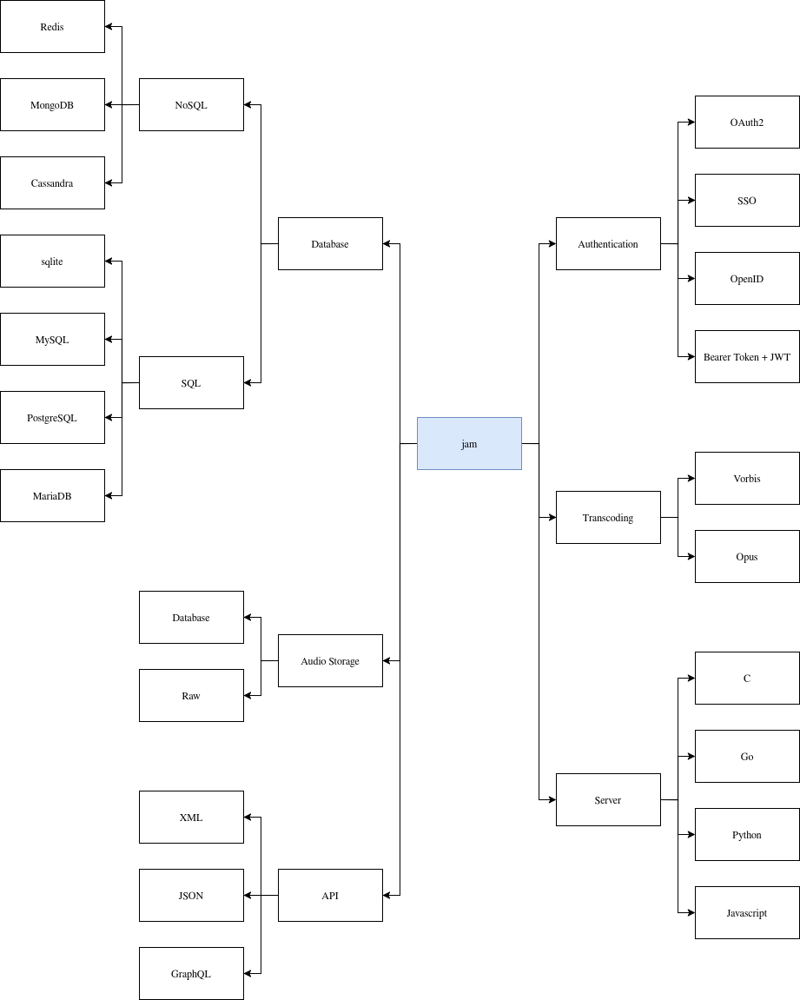

## Transcoding

We chose Opus because we need to be able to encode and decode as fast as possible while still achieving great quality.

- [Opus vs Ogg Vorbis: Which Audio Codec Should You Choose in 2025?](https://www.free-codecs.com/guides/ogg-opus-vs-ogg-vorbis-which-audio-codec-should-you-choose-in-2025.htm)
- [Comparison - Opus Codec](https://opus-codec.org/comparison/)

## Database

### Type

We chose SQL because there is more documentation about it and because it is easier to manage data with tables.

- [Difference between SQL and NoSQL](https://www.geeksforgeeks.org/sql/difference-between-sql-and-nosql)

### Software

We chose PostgreSQL because it is robust and polyvalent.

- [I Replaced My Entire Stack with Postgres](https://youtu.be/TdondBmyNXc)

## Audio Storage

Raw

## Server

We chose Go because of his scalability, performances and design.

- [Should you use Golang? Advantages, Disadvantages & Examples](https://www.devlane.com/blog/should-you-use-golang-advantages-disadvantages-examples)
- [Golang vs JavaScript](https://dev.to/charles_otugeh_fc71c7b02d/golang-vs-javascript-25aa)

## API

We chose JSON because it is fast to decode and encode and is also highly compatible with Go.

- [Why, after 6 years, I’m over GraphQL](https://bessey.dev/blog/2024/05/24/why-im-over-graphql/)
- [JSON vs. XML for APIs: Key Differences Explained for Beginners](https://www.codeitbro.com/blog/json-vs-xml)
- [Encoding and Decoding JSON with Structs in Go ](https://www.slingacademy.com/article/encoding-and-decoding-json-with-structs-in-go/)

## Authentication

We need OpenID because we want it to share users and their personnal data with other services.

- [An Illustrated Guide to OAuth and OpenID Connect](https://youtu.be/t18YB3xDfXI)
- [Authentication Explainer: When to Use Basic, Bearer, OAuth2, JWT & SSO](https://youtu.be/9JPnN1Z_iSY?si=Gr9kVjd3d7afYgBm)
